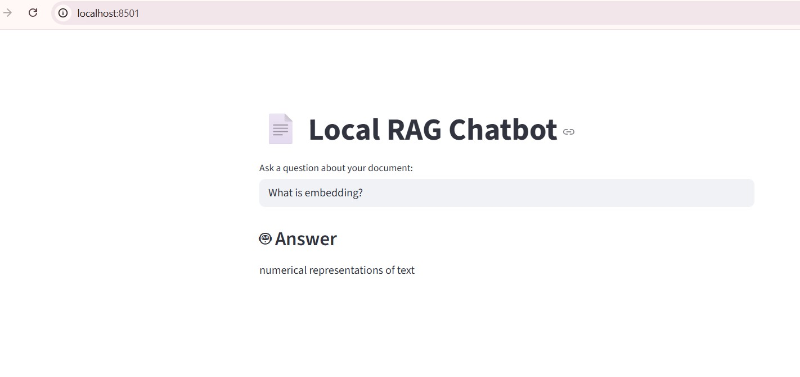

# rag-document-assistant
This project implements a Retrieval-Augmented Generation (RAG) system for document-based question answering. The system performs semantic search using FAISS and generates contextual responses using FLAN-T5.
# Architecture
Document chunking
Embedding generation using Sentence Transformers
Vector indexing with FAISS
Top-k similarity retrieval
Context-aware response generation using FLAN-T5
Interactive UI with Streamlit
# Tech Stack
Python
FAISS
Sentence Transformers
HuggingFace Transformers
FLAN-T5
Streamlit

